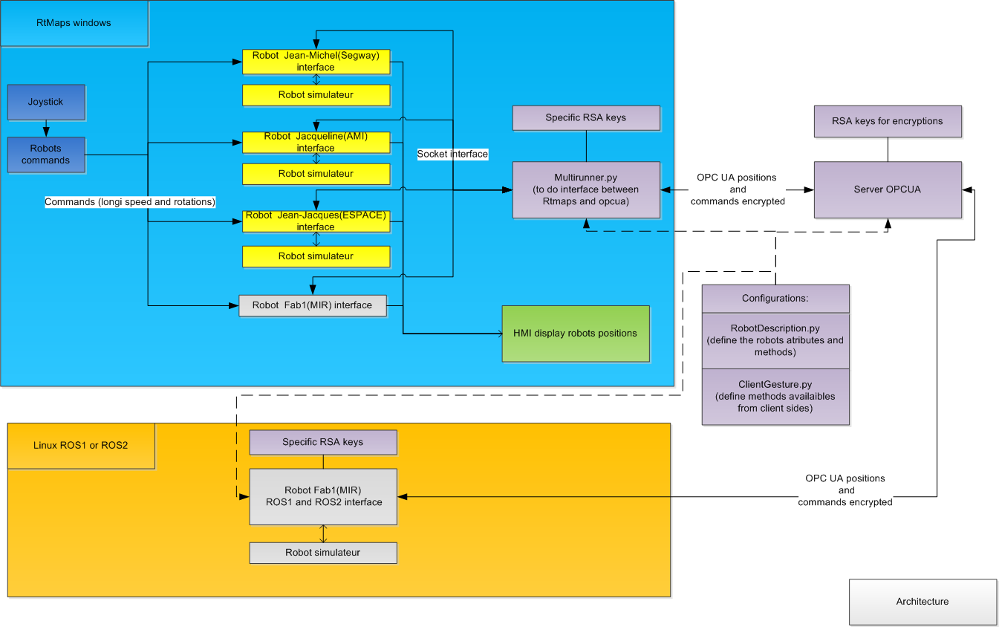
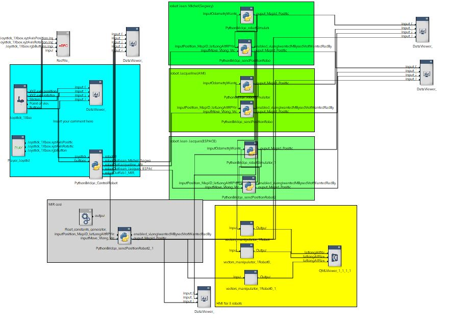
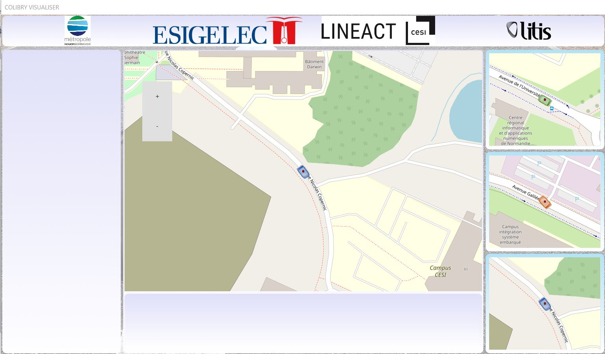

# opcuaRt

projet to try to create an architecture to communicate with robots from/to Rtmaps and ROS

The basic example in rtmaps directory allowed the possibility to operate several robots (4) from a main controller with Xbox joysticK

The architecture of the demo is visible here :


A video of the system working is availaible here 
[](https://www.youtube.com/watch?v=u2pMlTYwNlo "video of the system")

# installs done :


under windows :
pip install asyncua

under  Ubuntu:
apt install python-opcua        # Library
apt install python-opcua-tools  # Command-line tools

work is based o git https://github.com/FreeOpcUa/opcua-asyncio

## starting 
* first create certificate with generate_certificate.sh under linux, that will generate 3 files :
    - my_cert.der
    - my_cert.pem
    - my_private_key.pem

# server side
* To beguin to use it with your robots, modify file robotDescription.py file.
(The principe, is that all data availaibles in your robot (ROBOT_LIST) will be availaible in the server area and client will have access to it).
The file must be the same on the server side and the client side, if you are not the server administrateur contact him to do the modification

* run the server (cd opcuaRt\server\ then python server-with-encryption.py)
some parameters need to be filled to work well :
    - ENCRYPT : True if you want to user cerver with encryption
    - ADMIN_DICT : dictionary of certificate (usefull with you are using encryption)
    - USER_DICT : dictionary of certificate for user (cannot modify variables)
    - url: url where to the server bind
    - namespace : just a namespace
# client side (general informations)

to have access to method defined in  robotDescription.py robot class, just modify clientGesture.py to add methods decorated like following :
for example for methode "moveToPose" the python decoration will be :
```
@automatically_call_fromDescription
def moveToPose(self,timestamp, mapId, poseXYZrXYZ):
    """ask to go to a pose"""
    pass
```

# client side (ROS1)

* needed before:
    - ROS1 (ros noetic in my case, but can easyly be adapted to other ros)
    - python3 with asyncua, utm, scipy ...

* how to run it :
    - with vscode open directory :\ROS\catkin_ws 
    - run the task "catkin_make" (if you have a different ros installation, do not hesitate to modify the task)
    - run the task "run ros 1 launch" (if you have a different ros installation, do not hesitate to modify the task)

* how to configure it :
    - opcuaRt.launch : contain parameter to opc ua (certificate, url, enable encryp) and default position for robot simulator  

* what happened :
    there is two nodes, 
    - colibry_robot_simulator.py : robot simulator by integrating velocity command to generate a pose
    - robot_sender : interface asyncua with the robot, input are position, output are velocity command read from network and position read from network


# client side (ROS2)
* needed before:
    - ROS2 (ros rolling in my case, but can easyly be adapted to other ros)
    - python3 with asyncua, utm, scipy ...

* how to run it :
    - with vscode open directory :\ROS\ros2_ws 
    - run the task "colcon build" (if you have a different ros installation, do not hesitate to modify the task)
    - run the task "ros 2 launch" (if you have a different ros installation, do not hesitate to modify the task)

* how to configure it :
    - script_launch.py : contain parameter to opc ua (certificate, url, enable encryp) and default position for robot simulator 

* what happened :
    there is two nodes, 
    - colibry_robot_simulator.py : robot simulator by integrating velocity command to generate a pose
    - robot_sender : interface asyncua with the robot, input are position, output are velocity command read from network and position read from network

# client side (RtMaps)

For rtmaps the architecture is different because rtmaps python do not allow the ability to do multiprocess or multithread.

* for this reasons a python script call opcuaRt\client\multiRunner.py must be run before to open rtmaps, the goal is to do interface between rtmaps (by udp) and opcua rt. In this file you can configure parameters to interface with opc ua rt :
    - ROBOT_ALLOWED_LIST : the list of robot allowed for control (robot names must be robot specified in robotDescription.py)
    - ENCRYPT : encrypt or not the communication
    - certificate, privatekey (if encryption enabled)
    - communicationPeriod : time in s betweent two communication with server

* If you have rtmaps windows on your computer, you can open diagramme "rtmaps\robot1Diagram.rtd"

On the diagramme :
* blue part it a rtmaps python component to control the robots (button LT is deadman, left joystick control longi and rot speed, button A is to control previous robot, button Y is to controll next robot )
* green part are component to read robot information (like wanted longi speed, rot speed), send to the server the current robot pose (mapId, lat, long, alt, roll, pitch, yaw(in rad)) and a simple pythonrobot simulator (simple runge Kutta simulation )
* grey part is compoenent to read a robot under linux
* yellow part is an hmi to display robot pose on a map


When you run the diagram, you must obtain a qml windows with 3 robots simulated and the capacity to move the 3 robots with your xbox joystick




## comming soon 
    * possibility to upload image stream :)


